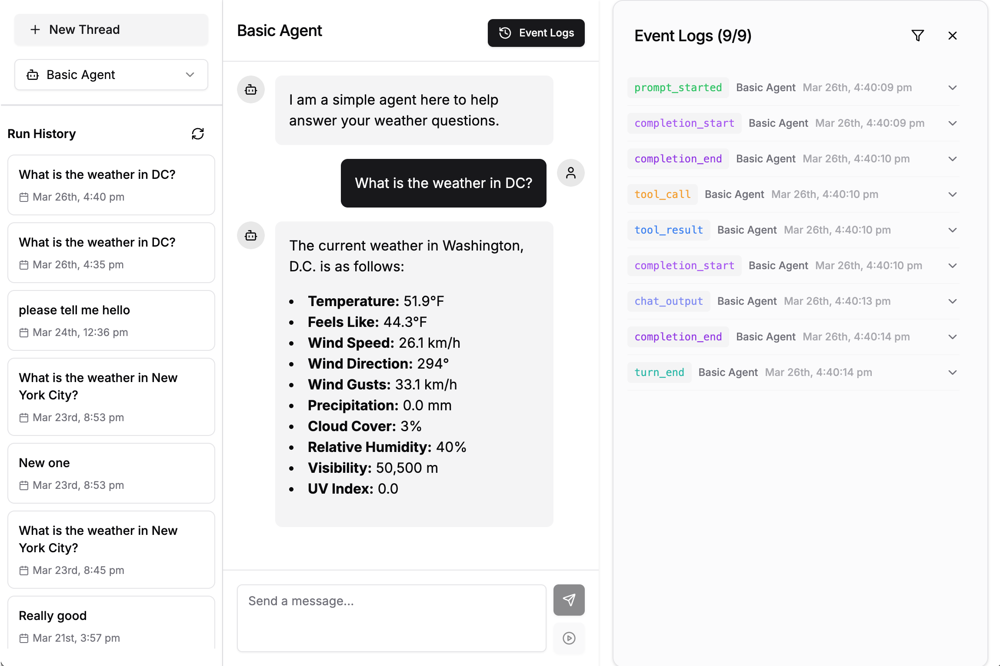

# Next.js Dashboard

The Agentic Dashboard is a web-based interface for interacting with your agents, monitoring their activities, and reviewing their run history. Built with [Next.js](https://nextjs.org/docs), it provides a modern, responsive UI that connects to your agents through the Agentic framework's REST API.



## Overview

The dashboard offers the following features:

- Chat with any registered agent
- View real-time agent event logs
- Run agents in the background while continuing to use the interface
- Browse run history to review past agent executions
- Monitor agent performance metrics

## Setup and Installation

### Prerequisites

The dashboard requires:

- Node.js (v18+) 
- npm (v8+)
- The Agentic framework with the dashboard extras

To install with dashboard support:

```bash
pip install agentic-framework[dashboard]
```

### Building the Dashboard

While not usually necessary, you can pre-build the dashboard for production:

```bash
agentic dashboard build
```

This compiles the Next.js application with optimizations for production use.

## Running the Dashboard

There are two ways to run the dashboard:

### Using the CLI

The simplest way to launch the dashboard is through the CLI:

```bash
# Start in production mode
agentic dashboard start

# Start in development mode with live reloading
agentic dashboard start --dev

# Specify a custom port
agentic dashboard start --port 8000

# Start an agent server alongside the dashboard
agentic dashboard start --agent-path examples/basic_agent.py
```

### Programmatically

You can also start the dashboard from Python code:

```python
from agentic.dashboard import setup

# Start the dashboard
process = setup.start_dashboard(port=3000, dev_mode=False)

# To stop the dashboard:
# process.terminate()
```

## Architecture

The dashboard uses a client-server architecture:

1. The **Backend Server** is your Agentic API server (started with `agentic serve` or `agentic dashboard start --agent-path <path>`)
2. The **Frontend Dashboard** is the Next.js application that communicates with the backend

### Backend Integration

The dashboard integrates with the Agentic framework's REST API endpoints:

- `/_discovery` - Lists all available agents
- `/<agent_path>/describe` - Gets agent information
- `/<agent_path>/process` - Sends prompts to an agent
- `/<agent_path>/getevents` - Streams events from an agent
- `/<agent_path>/runs` - Gets run history
- `/<agent_path>/runs/{id}/logs` - Gets logs for a specific run

The API integration is implemented in `src/app/lib/api.ts`, which provides a client-side wrapper around these endpoints.

## Component Structure

The dashboard is built with modular React components:

- `AgentChat` - The main chat interface for interacting with agents
- `AgentSidebar` - Navigation sidebar for agent selection and run history
- `EventLogs` - Real-time event log viewer
- `BackgroundTasks` - Background task manager
- `RunsTable` - Table of historical agent runs
- `MarkdownRenderer` - Renderer for agent markdown responses

### Data Flow

Data flows through the application using the following pattern:

1. The `useAgentData` hook fetches available agents and their information
2. The `useChat` hook manages chat interactions and event streaming
3. Components render the UI based on this data
4. User actions trigger API calls which update the data

## Event Streaming

A key feature of the dashboard is real-time event streaming from agents. This works through Server-Sent Events (SSE):

1. When a user sends a prompt, the dashboard calls the `/process` endpoint
2. It then connects to the `/getevents` endpoint with the request ID
3. The server streams events as they occur (chat output, tool calls, etc.)
4. The client processes these events and updates the UI accordingly

The `useChat` hook encapsulates this logic, providing components with a clean interface for chat functionality.

## Background Tasks

Agents can be run in the background while you continue using the interface:

1. Enter a prompt and click the background task button
2. The task runs independently of the main chat thread
3. You can monitor its progress in the background tasks panel
4. Results are stored and can be reviewed later

This feature is particularly useful for long-running tasks.

## Development Mode

For dashboard development, use the `--dev` flag:

```bash
agentic dashboard start --dev
```

This launches Next.js in development mode with:
- Hot module reloading
- Detailed error messages
- Source maps for debugging

## Customization

The dashboard uses Tailwind CSS for styling and can be customized by modifying:

- `tailwind.config.ts` for theme settings
- `globals.css` for global styles
- Component-level styles within each React component

## Troubleshooting

Common issues and solutions:

- **Dashboard fails to start**: Ensure Node.js and npm are installed and up to date
- **Cannot connect to agents**: Make sure the Agentic server is running (`agentic serve` or `agentic dashboard start --agent-path <path>`)
- **UI not updating after changes**: Make sure you started the dashboard in development mode (`--dev`)
